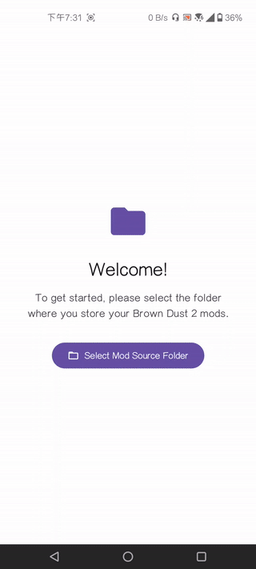

[English](./README.md) | [繁體中文](./README.zh-TW.md)

---

# BrownDust 2 Android Mod Manager

No need for a PC to unpack and repack.

---

## Features

*   **Automatic Scan & Grouping**: Automatically scans your specified mod folder and intelligently groups mods based on the game files they modify.
*   **Parallel Processing**: Select mods from different groups and process them all in a single batch. The app handles everything concurrently.
*   **On-Device Repacking**: Unpack, convert resources (ASTC), and repack mods directly on your phone without needing a computer.
*   **Spine Animation Preview**: Long-press any mod in the list to open a live preview of the Spine animation before installation.
*   **Standalone Bundle Unpacker**: A utility for advanced users to unpack any game asset bundle (`__data` file) directly on your device.

## System Requirements

*   Android 11 or higher.
*   The latest official version of BrownDust 2 installed.

## Installation

1.  [Download](https://github.com/Ark-Repoleved/bd2-android-mod-manager/releases) the `.apk` file for this application.
2.  Tap the downloaded `.apk` file to install.

## First-Time Setup

Before you can start installing mods, you need to complete a one-time authorization step:

1.  Open the app, and you will see a welcome screen.
2.  Tap the **"Select Mod Source Folder"** button.
3.  In the file picker that appears, navigate to where you store your mod files (e.g., `.zip` archives or extracted folders), and then tap **"Use this folder"**.
    *   *Recommendation:* Create a folder named `.BD2_Mods` in your phone's storage and place all your downloaded mods there.

## Folder/.zip Structure

For mods to be installed successfully, each mod must be placed within its own dedicated folder or`.zip` file inside the `BD2_Mods/` directory. The filenames within your mod folder **must** exactly match the original asset names used in the game's Unity bundles.

Here is a typical layout, using assets for "Lathel: Dark Knight" as an example:

```
📁 .BD2_Mods/
├── 📁 Lathel_IDLE/
│   ├── 📄 char000104.skel (or.json)  # The Spine skeleton data
│   ├── 📄 char000104.atlas           # The atlas mapping file
│   └── 🖼️ char000104.png             # The texture atlas image(s)
│
└── 📁 another_mod/
    └── ... (other mod files)
```

## How to Install Mods

1.  **Select Mods**: On the main screen list, check one or more mods you want to install. You can now select mods from different groups (Targets) at the same time.
2.  **Start Repacking**: Tap the floating action button with the **check mark (✓)** at the bottom right.
3.  **Automatic Download & Repack**: A new dialog will appear, showing the live progress for each mod group. The app automatically downloads the latest original game files for each group from the official servers and repacks your selected mods in parallel.
4.  **Manually Replace the File**:
    *   After a successful installation, a new, modified `__data` file will be saved to your phone's **`Download`** folder with the filename `__[hashed_name]`.
    *   **You need to manually copy or move this file to the corresponding game folder, overwriting the original `__data` file.**
    *   You can use a third-party file manager (with special permissions) to do this. The dialog will provide a one-click ADB command that can be executed via [ShizuTools](https://github.com/legendsayantan/ShizuTools) to automate the replacement.

## Guide Video

<p align="center">
  
</p>

## Other Features

### Spine Animation Preview

To ensure a mod looks right before you install it, you can preview its animation directly.

1.  Find the mod you want to check in the main list.
2.  **Long-press** on the mod's card.
3.  A new screen will open, playing the `.skel` or `.json` animation.

### Standalone Bundle Unpacker

This tool allows you to extract bundles file from the game.

1.  On the main screen, ensure no mods are selected.
2.  Tap the floating action button with the **unarchive (📤)** icon at the bottom right.
3.  Select the `__data` file you wish to unpack.
4.  The contents will be extracted to your phone's **`Download/outputs`** folder.

## FAQ

*   **Q: Why aren't my mods showing up in the app?**
    *   A: Please ensure you have correctly selected the "Mod Source Folder". Also, make sure your mods are in `.zip` format or are unzipped folders.

*   **Q: What should I do if the installation fails?**
    *   A: Installation can fail for a few reasons: 1) A network error occurred while downloading the original game files. 2) The mod file names are incorrect. 3) An unexpected error occurred during the repacking process. Check the error message in the dialog for more details and ensure your internet connection is stable.

*   **Q: What if the graphics are corrupted after installing a mod and entering the game?**
    *   A: This is likely because the mod itself doesn't support Android BD2, or missing the `.skel` or `.json` file. A complete mod requires `.png`, `.atlas`, and `.skel` or `.json` files to function correctly.

---

## Credits

The development of this application would not have been possible without the contributions of the following open-source projects and tools. Special thanks to:

*   **[browndust2-repacker-android](https://codeberg.org/kxdekxde/browndust2-repacker-android)**: Provided the core techniques for repacking `__data` files, including handling ASTC texture compression and LZ4 compression.
*   **[ReDustX](https://github.com/Jelosus2/ReDustX)**: Provided the core techniques for `.json` to `.skel` mechanism and download Original `__data` file from game's CDN.
*   **[UnityPy](https://github.com/K0lb3/UnityPy)**: A Python library that is fundamental for reading, modifying, and saving Unity game assets.
*   **[ARM-software/astc-encoder](https://github.com/ARM-software/astc-encoder)**: The official ASTC texture encoder from ARM, used to convert mod textures into a format compatible with the game system.
