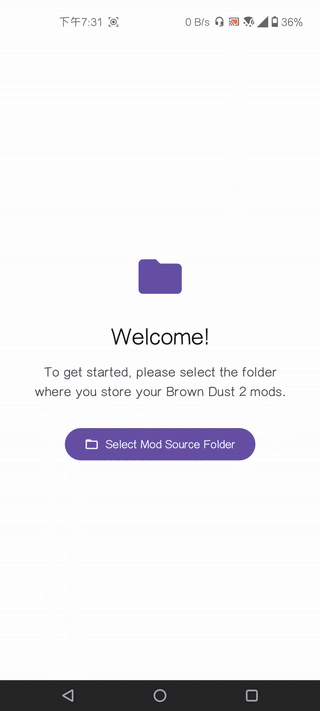

[English](./README.md) | [繁體中文](./README.zh-TW.md)

---

# BrownDust 2 Android 模組管理器

解包封包不用跑電腦上了。

---

## 功能介紹

*   **自動掃描與分組**: 自動掃描您指定的模組資料夾，並根據模組要修改的遊戲檔案進行智慧分組。
*   **平行處理**: 可一次選取不同分組的模組，應用程式會將所有任務同步處理，大幅提升效率。
*   **裝置上打包**: 無需連接電腦，直接在您的手機上完成模組的解包、資源轉換 (ASTC) 和重新打包。
*   **Spine 動畫預覽**: 在安裝前，可透過長按列表中的任何模組，直接預覽其 Spine 動畫效果。
*   **獨立資源解包工具**: 為進階使用者提供的一個實用工具，可直接在裝置上解開任何遊戲資源檔 (`__data` 檔)。

## 系統需求

*   Android 11 或更高版本。
*   已安裝《棕色塵埃2》官方最新版本。

## 安裝教學

1.  [下載](https://github.com/Ark-Repoleved/bd2-android-mod-manager/releases)本應用程式的 `.apk` 檔案。
2.  點擊下載的 `.apk` 檔案進行安裝。

## 首次使用設定

在您開始安裝模組前，需要先完成一個授權步驟：

1.  開啟 App，您會看到一個歡迎畫面。
2.  點擊 **「Select Mod Source Folder」** 按鈕。
3.  在跳出的檔案選擇器中，導覽至您存放模組檔案 (例如 `.zip` 壓縮檔或已經解壓縮的資料夾) 的位置，然後點擊 **「使用這個資料夾」**。
    *   *建議：* 您可以在手機儲存空間中建立一個名為 `BD2_Mods` 的資料夾，將所有下載的模組都放在這裡。

## 資料夾與 .zip 結構規範

為了確保模組能成功安裝，請將每個模組放置於 `.BD2_Mods/` 路徑下各自獨立的資料夾或 `.zip` 壓縮檔中。檔案名稱必須與遊戲內部 Unity bundles 中使用的資產名稱完全一致。

一個典型的檔案結構如下，此處以「Lathel: Dark Knight」的角色資產為例：

```
📁 .BD2_Mods/
├── 📁 Lathel_IDLE/
│   ├── 📄 char000104.skel (或 .json)  # Spine 骨架檔案
│   ├── 📄 char000104.atlas            # Atlas 材質貼圖集定義檔
│   └── 🖼️ char000104.png              # 材質貼圖圖片
│
└── 📁 another_mod/
    └── ... (其他模組檔案)
```

## 如何安裝模組

1.  **選擇模組**: 在主畫面的列表中，勾選您想要安裝的一或多個模組。您現在可以同時選取屬於不同分組 (Target) 的模組。
2.  **開始打包**: 點擊右下角的 **打勾 (✓)** 浮動按鈕。
3.  **自動下載與打包**: 一個新的對話方塊會出現，即時顯示每一個模組群組的處理進度。應用程式會自動從官方伺服器為每個群組下載最新的原始遊戲檔案，並在背景平行處理所有打包任務。
4.  **手動替換檔案**:
    *   安裝成功後，新的、修改過的 `__data` 檔案會被儲存到您手機的 **`Download` (下載)** 資料夾中，檔名為 `__[hashed_name]`。
    *   **您需要手動將這個檔案複製或移動到遊戲的對應資料夾中，覆蓋掉原始的 `__data` 檔案。**
    *   您可以使用第三方檔案管理器 (需要特殊權限) 來完成此操作。對話框中會提供一鍵複製的 ADB 指令，可以透過 [ShizuTools](https://github.com/legendsayantan/ShizuTools) 在手機中執行自動替換指令。

## 操作影片

<p align="center">
  
</p>

## 其他功能

### Spine 動畫預覽

為了在安裝前確認模組的動畫是否正確，您可以直接預覽。

1.  在主列表中找到您想預覽的模組。
2.  **長按**該模組的卡片。
3.  一個新的預覽視窗將會開啟，並播放其 `.skel` 或 `.json` 動畫。

### 獨立資源解包工具

此工具讓您可以提取遊戲資源檔的內容。

1.  在主畫面上，確保沒有選取任何模組。
2.  點擊右下角的**解包 (📤)** 浮動按鈕。
3.  選擇您想要解包的 `__data` 檔案。
4.  解包後的內容將會被儲存到您手機的 **`Download/outputs`** 資料夾中。

## 常見問題

*   **Q: 為什麼 App 沒顯示我的模組？**
    *   A: 請確認您已正確選擇了存放模組的「模組來源資料夾」。同時，請確保您的模組是 `.zip` 格式或已解壓縮的資料夾。

*   **Q: 安裝失敗了怎麼辦？**
    *   A: 安裝失敗可能由幾個原因造成： 1) 下載原始遊戲檔案時發生網路錯誤。 2) 模組檔案名稱不正確。 3) 打包過程中發生非預期的錯誤。請檢查對話方塊中顯示的錯誤訊息，並確保您的網路連線穩定。

*   **Q: 安裝完模組進到遊戲後發現畫面出錯了怎麼辦？**
    *   A: 這很可能是因為模組本身不支援安卓版 BD2，或是缺少了 `.skel` 或 `.json` 檔案。一個完整的模組需要包含 `.png`、`.atlas` 和 `.skel` 或 `.json` 三種檔案才能正常運作。

---

## 致謝

本應用程式的開發離不開以下開源專案和工具的貢獻，特此感謝：

*   **[browndust2-repacker-android](https://codeberg.org/kxdekxde/browndust2-repacker-android)**: 提供重新打包 `__data` 檔案的核心技術，包括 ASTC 紋理壓縮和 LZ4 壓縮的處理方法。
*   **[ReDustX](https://github.com/Jelosus2/ReDustX)**: 提供將 `.json` 轉換成 `.skel` 與從伺服器下載原始 `__data` 檔案的核心技術。
*   **[UnityPy](https://github.com/K0lb3/UnityPy)**: Python 函式庫，是讀取、修改和儲存 Unity 遊戲資產的基礎。
*   **[ARM-software/astc-encoder](https://github.com/ARM-software/astc-encoder)**: ARM 官方提供的 ASTC 紋理編碼器，用於將模組紋理轉換為與遊戲相容的格式。
